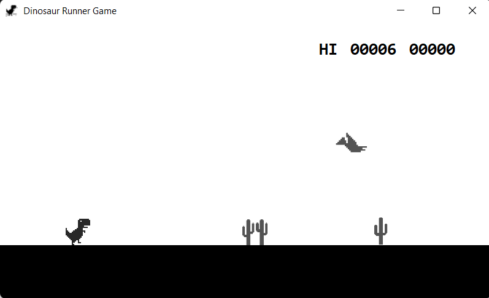

<a name="readme-top"></a>


<!-- PROJECT LOGO -->
<br />
<div align="center">
  <a href="https://github.com/queenalimm/DinoRunGame">
    
  </a>


<h3 align="center">DINOSAUR RUNNER GAME</h3>

  <p align="center">
    A game where the dinosaur keeps on running.
    <br />
    Developed by
    <br / >
    QUEENA LIM 2210410 &
    AMIRAH AKMA 2210392 
    
  </p>
</div>


<!-- ABOUT THE GAME -->
## About The Game



Dinosaur Runner Game - a replica of the endless runner game originally built into Google Chrome. It is an hidden game from Chrome offline mode where you jump over obstacles and avoid collisions. The goal is to achieve the highest score by surviving as long as possible without hitting any obstacles.

This game is written in C# and is based on the Windows Forms framework. The game features a dinosaur that moves from left to right across the screen, and the player can make it jump to avoid obstacles. As the player progresses and scores points, the game becomes more challenging by increasing the speed of the obstacles.


<!-- GETTING STARTED -->
## Getting Started

To get a local copy up and running follow these simple steps.


### Installation

1. Download and install a compatible .NET framework on your Windows machine.
2. Clone or download the repository containing the Dino Run Game code.
   ```sh
   git clone https://github.com/queenalimm/DinoRunGame.git
   ```
3. Open the solution in Visual Studio or your preferred C# IDE.
4. Build the project to ensure there are no build errors.
5. Run the application, and the game window will appear.


<!-- HOW TO PLAY -->
## How To Play

The objective of the game is to survive as long as possible by avoiding collisions with obstacles. The player can control the dinosaur to jump by pressing the Spacebar key on the keyboard. Timing the jumps accurately is crucial for avoiding obstacles.

<b>Controls</b>
<br />
Spacebar: Pressing the Spacebar makes the dinosaur jump. It can only jump when it is on the ground and not already in mid-air.

<b>Game Mechanics</b>
<br />
The game involves the following mechanics:

1. Jumping: When the player presses the Spacebar, the dinosaur performs a jump. The jump has a fixed vertical speed, and the player must time the jumps to clear obstacles successfully.

2. Gravity: The dinosaur experiences a downward force when it is in the air. This force gradually decreases until it reaches zero, allowing the dinosaur to fall back to the ground.

3. Scoring: The player's score increases as the dinosaur successfully jumps over obstacles. The longer the player survives, the higher the score will be.

4. Obstacles: There are obstacles that move from right to left across the screen. If the dinosaur collides with an obstacle, the game is over.

5. Increasing Difficulty: As the player's score increases, the speed of the obstacles also increases, making the game more challenging.


<!-- CONTACT -->
## Contact

If you have any problems, do contact us using the email below. 

Queena Lim - queena2512@gmail.com

Amirah Akma - amirahakma24@gmail.com


<!-- CREDITS -->
## Credits
This Dino Run Game was created by QUEENA and AMIRAH. The game mechanics and code were inspired by classic side-scrolling games. Feel free to modify and enhance the game according to your preferences.

Enjoy playing Dino Run Game and see how high you can score! If you encounter any issues or have suggestions for improvements, please feel free to contribute to the project or report them.

Thank you for playing! Have fun!

Project Link: [https://github.com/queenalimm/DinoRunGame](https://github.com/queenalimm/DinoRunGame)
